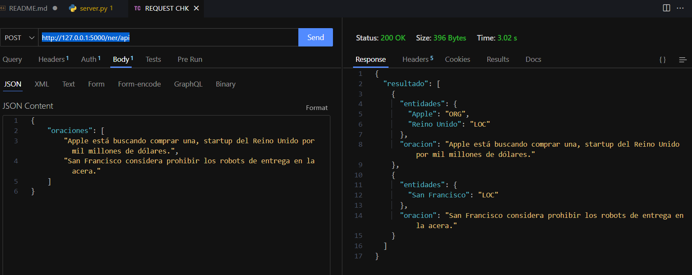

# Named Entity Recognition

### Dependences
-   flake8==6.0.0
-   Flask==2.2.2
-   numpy==1.19.3
-   pandas==1.4.1
-   typing==3.7.4.3
-   spacy==3.6.1

### Test
You sould have python >= 3.8  
You only need to run the file server.py, one wsgi will be enable to make requests http://localhost:80/ner/api or depending your coomputer.  
Ready!
